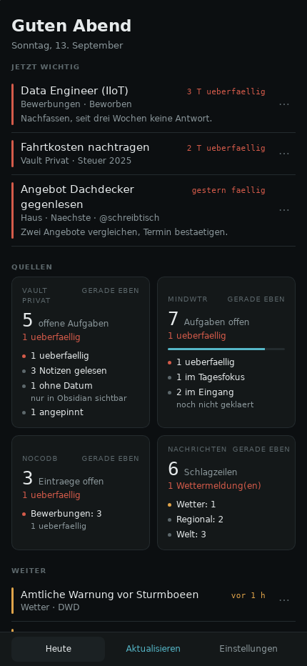
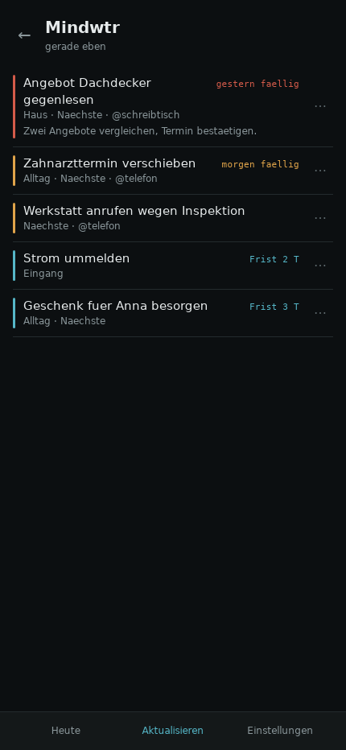
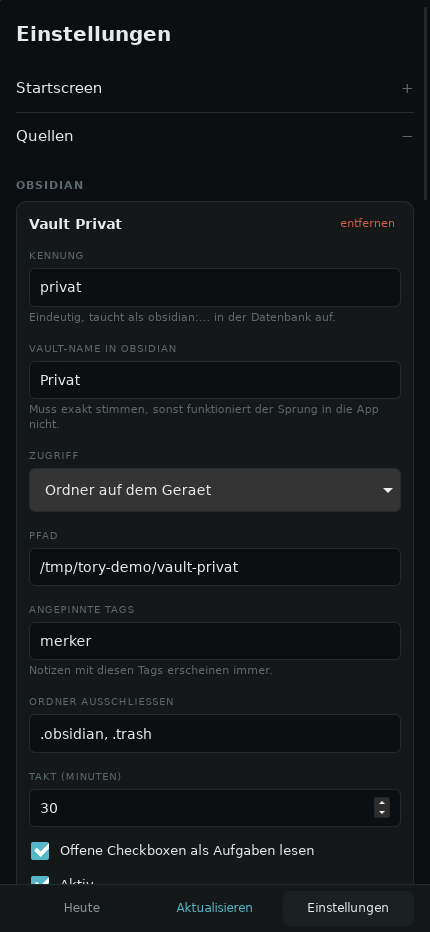

# Tory

Persoenliches Dashboard als Tauri-App fuer Android (und Desktop). Ein Screen
fuer Notizen, Aufgaben, Tabellen, Mail und Nachrichten — statt acht App-Starts
am Morgen.

Angebunden sind, alle frei konfigurierbar und in mehreren Instanzen:

| Quelle | Woher | Was daraus wird |
| --- | --- | --- |
| **Obsidian** — beliebig viele Vaults | Ordner oder WebDAV | offene Checkboxen mit Frist, angepinnte Notizen |
| **Mindwtr** — selbst gehostet | REST unter `/v1` **oder** die `data.json` des WebDAV-Syncs | Aufgaben nach Status, Faelligkeit, Tagesfokus |
| **NocoDB** — selbst gehostet | API v2, `xc-token` | beliebige Tabellen ueber eine Spaltenzuordnung |
| **Gmail** | Gmail API, lesend | Ungelesenes je Suchausdruck |
| **Nachrichten** | RSS / Atom / JSON Feed | regional, weltweit, Wetter |

Dazu eine AI-Schicht (Anthropic, OpenAI, Ollama) mit eigenen Schluesseln: der
erste Schritt, das Tagesbriefing, laeuft.

## So sieht es aus

| Heute | Quelle | Einstellungen |
| --- | --- | --- |
|  |  |  |

Aufnahmen der laufenden App mit Beispieldaten, nicht aus einem Entwurf. Links
oben: drei Signale aus drei verschiedenen Quellen, quellenuebergreifend nach
Dringlichkeit sortiert — eine NocoDB-Zeile, eine Obsidian-Aufgabe und eine aus
Mindwtr, ohne dass der Startscreen weiss, woher sie kommen.

Zum Nachstellen braucht es keinen einzigen echten Dienst:

```bash
cargo run -p tory-core --example demo -- /tmp/tory-demo 8799
# in einer zweiten Sitzung:
XDG_DATA_HOME=/tmp/tory-demo npm --prefix app run tauri dev
```

Das Beispiel startet einen kleinen Server, der sich wie Mindwtr, NocoDB und drei
Nachrichtenfeeds verhaelt, legt daneben einen echten Obsidian-Vault aus
Markdown-Dateien an und schreibt eine passende Konfiguration. Alle Datumsangaben
entstehen relativ zu heute — eine Beispielmenge mit festen Daten veraltet, und
ein Startscreen, auf dem alles ueberfaellig ist, zeigt nicht, was er zeigen soll.

## Stand

M0 bis M2 sind gebaut: Kern, alle fuenf Anbindungen, Oberflaeche mit
vollstaendigen Einstellungen. Der Kern hat 111 Tests — 106 gegen
aufgezeichnete Antworten der Dienste, fuenf als Durchstich gegen einen
lokalen Testserver, die Rust-Seite ist clippy-sauber, die Oberflaeche
typprueft ohne Fehler.

Was fehlt, ist die Android-Uebersetzung selbst (`tauri android init`,
Signierung, Geraetetest) — dafuer braucht es ein Android-SDK, siehe unten.

## Aufbau

```
crates/tory-core/    Rust-Kern: Modell, Anbindungen, SQLite, Sync, AI
                     — ohne Tauri, deshalb ohne Emulator testbar
app/                 Tauri-App
  src/               Svelte 5 + TypeScript
  src-tauri/         Schale: Fenster, Zustand, Befehle
docs/                Konzept, Architektur, Einrichtung, Roadmap
mockups/             Die drei Designrichtungen als Artifact-Seite
archiv/              Der abgeloeste Kotlin-Entwurf
```

Die Trennung ist der Kern der Sache: in `app/src-tauri` steht keine Entscheidung,
jeder Befehl ist eine Zeile Weiterleitung. Was entschieden wird, liegt in
`tory-core` — und laesst sich ohne Android-SDK, ohne WebView und ohne Netz
pruefen.

| Was | Wo |
| --- | --- |
| Produktkonzept, Quellen, Reihenfolge | [`docs/konzept.md`](docs/konzept.md) |
| Technische Architektur | [`docs/architektur.md`](docs/architektur.md) |
| **Quellen einrichten — Schritt fuer Schritt** | [`docs/integrationen.md`](docs/integrationen.md) |
| Datenmodell und Vertraege | [`docs/schnittstellen.md`](docs/schnittstellen.md) |
| AI und was noch kommt | [`docs/roadmap-ki.md`](docs/roadmap-ki.md) |
| Die drei Designrichtungen | [`docs/design-richtungen.md`](docs/design-richtungen.md) |

## Bauen

### Voraussetzungen

Rust (stabil), Node 20+, und fuer den Desktop die ueblichen Tauri-Pakete —
unter Ubuntu/Debian:

```bash
sudo apt install libwebkit2gtk-4.1-dev libsoup-3.0-dev librsvg2-dev \
                 build-essential curl wget file libssl-dev
```

### Kern pruefen (braucht nichts davon)

```bash
cargo test -p tory-core        # 111 Tests, kein Dienst noetig
cargo clippy --all-targets
```

### Desktop

```bash
cd app
npm install
npm run tauri dev              # oder: npm run tauri build
```

Der Desktop ist die schnelle Schleife: dieselbe Oberflaeche, derselbe Kern,
ohne Emulator. Das Fenster ist bewusst telefonschmal.

### Android — das APK kommt aus der CI

Der einfachste Weg zum installierbaren APK fuehrt ueber GitHub Actions: der
Runner bringt Android-SDK und NDK mit, zusammen mehrere Gigabyte, die sonst
lokal liegen muessten.

```
Actions → „Android-APK" → Run workflow        (oder einfach pushen)
                        ↓
              Artifacts → tory-apk-<sha>
```

Jeder Push auf `main` oder einen `claude/**`-Branch baut mit; per *Run workflow*
laesst sich waehlen, ob nur fuer `aarch64` (jedes Telefon seit etwa 2016,
Samsung Galaxy eingeschlossen) oder fuer alle vier Architekturen gebaut wird.

Das Ergebnis ist ein **Debug-APK**. Das ist Absicht:

* Es ist mit dem Debug-Schluessel signiert und damit installierbar. Ein
  Release-APK waere ohne eigenen Keystore unsigniert und liesse sich gar nicht
  installieren.
* `usesCleartextTraffic` ist darin an. Selbst gehostete Dienste laufen im
  eigenen Netz oft ueber `http://192.168.…`, und ein Release-Build blockiert das.

Zum Installieren: Artefakt herunterladen, entpacken, die `.apk` auf das Telefon
uebertragen und oeffnen. Android fragt einmal nach der Erlaubnis, aus dieser
Quelle zu installieren. Release-Signierung steht im Anhang von
[`docs/integrationen.md`](docs/integrationen.md#anhang--release-signierung).

**Zur Groesse.** Ein unveraendertes Debug-Profil packt die vollstaendigen
DWARF-Symbole mit ins APK; aus rund neun Megabyte Code werden so dreihundert.
Der CI-Lauf setzt deshalb drei Cargo-Schalter (`DEBUG=false`, `STRIP=symbols`,
`OPT_LEVEL=2`) — das APK bleibt debug-signiert und damit installierbar, traegt
aber keine Symbole mehr und laeuft optimiert. Lokal aendert sich nichts: wer
hier entwickelt, behaelt Symbole und schnelles Uebersetzen.

Gemessen:

| Was | Vorher | Nachher |
| --- | --- | --- |
| APK (aarch64, debug-signiert) | 59,7 MB | **12,4 MB** |
| Desktop-Binaerdatei | 286 MB (`cargo build`) | **9,1 MB** (`--release`) |

Beides dieselbe Software. Der Unterschied sind Debug-Symbole, nicht Programm.

> **Der Lauf braucht Actions-Minuten.** Dieses Repository ist privat, und
> private Repositories rechnen jede Minute gegen das Kontingent des Kontos.
> Ist es aufgebraucht, brechen Laeufe nach wenigen Sekunden ab — ohne Runner,
> ohne Protokoll, ohne Fehlermeldung. Genau so verhalten sich die bisherigen
> Laeufe, weshalb der Ablauf noch nie durchgelaufen ist.
>
> Abhilfe: unter *Settings → Billing* das Ausgabenlimit heraufsetzen, den
> Monatswechsel abwarten, oder das Repository auf oeffentlich stellen —
> oeffentliche Repositories bauen unbegrenzt und kostenlos.
>
> Geprueft ist der Ablauf, soweit das ohne Runner geht: `actionlint` samt
> `shellcheck` laeuft sauber durch, die verwendeten Tauri-Schalter
> (`android init --ci --skip-targets-install`, `android build --apk --debug
> --target aarch64`) sind gegen die CLI abgeglichen, und
> `scripts/android-manifest.mjs` ist gegen ein echtes Tauri-Manifest getestet.

### Android — lokal

```bash
# einmalig: Android SDK + NDK, dann
export ANDROID_HOME=$HOME/Android/Sdk
export NDK_HOME=$ANDROID_HOME/ndk/<version>
rustup target add aarch64-linux-android armv7-linux-androideabi \
                  i686-linux-android x86_64-linux-android

cd app
npm run tauri -- android init --skip-targets-install
node scripts/android-manifest.mjs          # Deep-Link eintragen
npm run tauri -- android dev               # oder: android build --apk --debug
```

Der Schritt mit `scripts/android-manifest.mjs` ist nicht optional: ein eigenes
URL-Schema wie `de.tory.app://` laesst sich auf Android nicht aus
`tauri.conf.json` anmelden — dort gibt es unter `deep-link.mobile` nur App Links
ueber https. Ohne den Eintrag startet die Gmail-Anmeldung zwar, aber die
Rueckleitung kommt nie an. Das Skript ist idempotent und bricht ab, wenn sich
der Aufbau des erzeugten Manifests geaendert hat.

`gen/android` liegt bewusst nicht im Repository: es ist Bauergebnis und haengt
an der Tauri-Version. Was daran Quelltext ist, steht im Skript.

## Wo die Daten liegen

Alles im privaten Datenverzeichnis der App (in den Einstellungen unter *Ueber*
nachzulesen):

```
config.json            URLs, Vault-Namen, Feeds, Takte — lesbar, weitergebbar
secrets/secrets.bin    Tokens und API-Schluessel, AES-256-GCM
secrets/device.key     der Geraeteschluessel
tory.sqlite3           Signale, Uebersichten, Sync-Stand
```

`config.json` enthaelt nie ein Geheimnis, sondern nur dessen Namen. Deshalb
laesst sie sich sichern und weitergeben, ohne etwas herauszuschneiden.

Zur Einordnung: der Geraeteschluessel liegt neben den Daten. Das schuetzt gegen
andere Apps, nicht gegen jemanden mit Dateizugriff auf ein entsperrtes Geraet.
Der Android Keystore steht in [`docs/roadmap-ki.md`](docs/roadmap-ki.md) unter
den offenen Punkten.

## Hinweis zu den Mockups

`mockups/tory-mockups.html` ist ein HTML-Fragment ohne `<html>`/`<head>`/`<body>`
— es wird als Claude-Artifact gerendert. Zum lokalen Ansehen in ein Grundgeruest
einbetten. Die Mockups zeigen noch den frueheren Quellensatz (Pakete, Konten);
als Vergleich der drei Designrichtungen gelten sie weiter. Gebaut ist Richtung B
(„Cockpit"), Richtung A („Ruhiger Morgen") liegt als helles Thema daneben und
ist in den Einstellungen umschaltbar.
